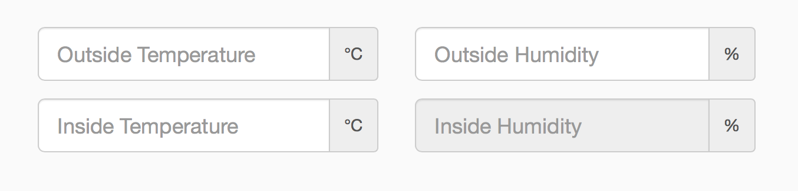

# Humidity-Calculator
Simple html form to calculate the expected relative humidity when heating/cooling an air souce with known relative humidity.  
Written in javascript and HTML, stlying based on bootstrap.js.  

Maths can be found in `HumidityMaths.pdf`  
Example Matlab plot found in `MatlabPlot.m`  

Running here:  
http://www.richard-stanton.com/humidity-calculator/

## Screenshot

# Todo
Add location information from browser to automatically pre-populate the form with local weather information.
